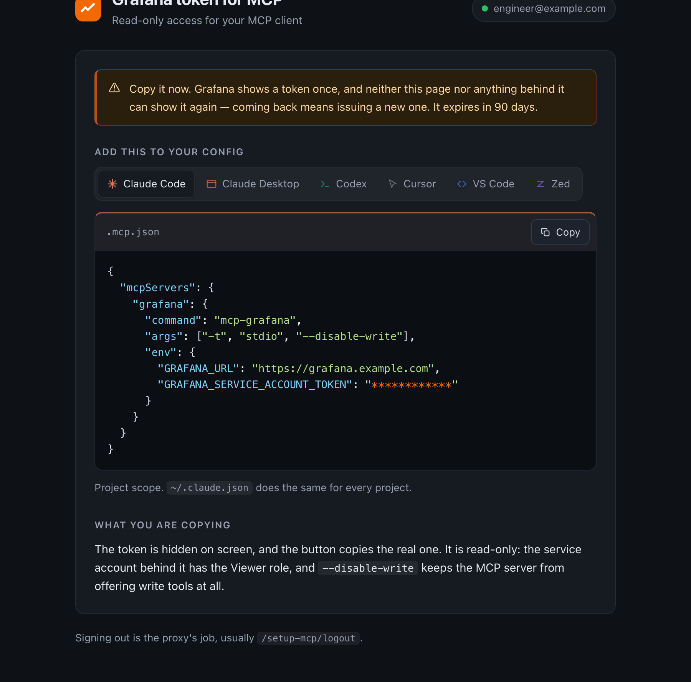
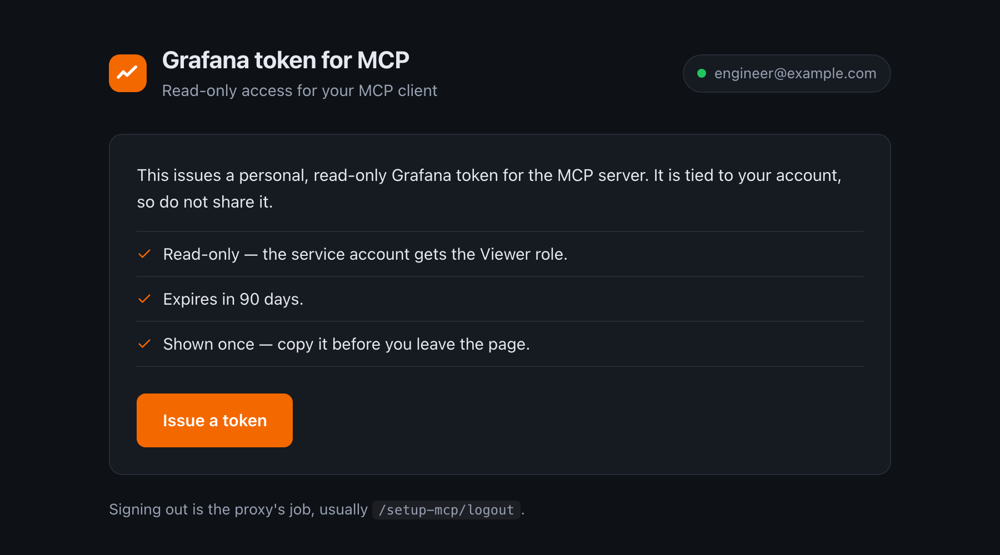
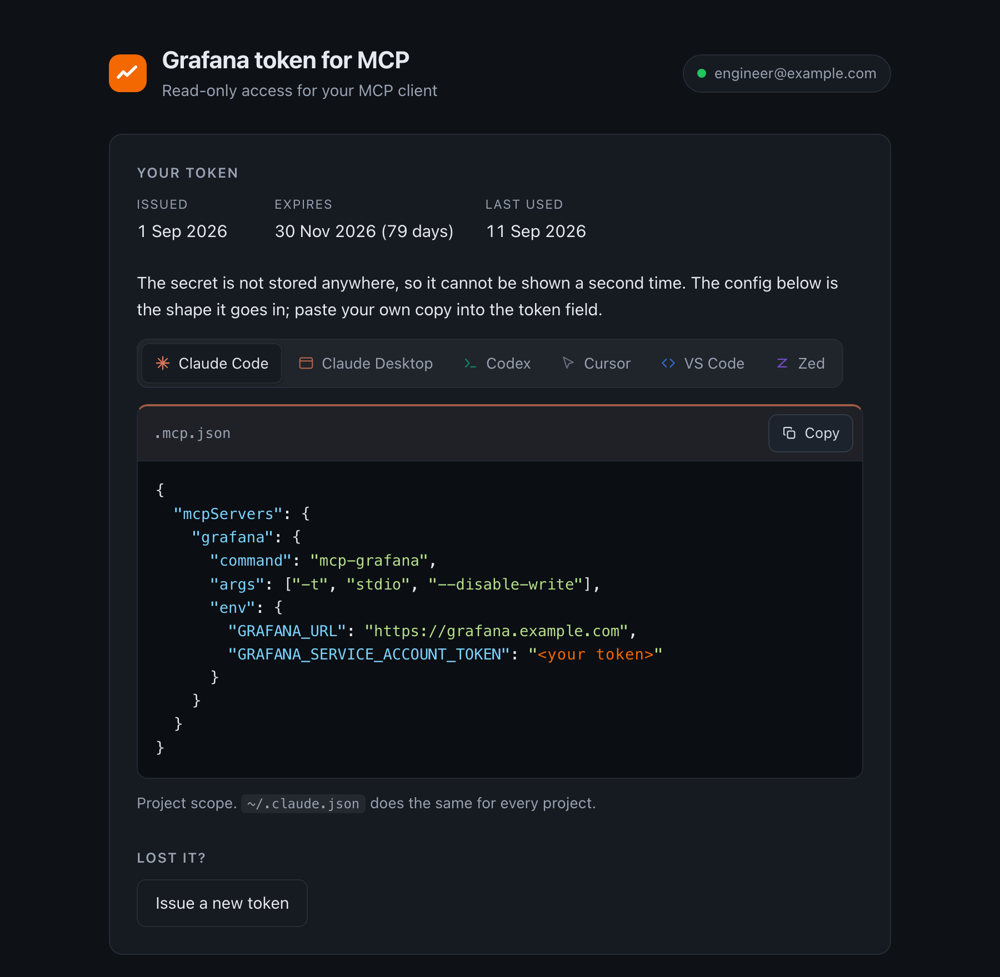

# grafana-mcp-setup

Issue personal Grafana service-account tokens after OIDC login. The page supplies
configurations for Claude Code, Claude Desktop, Codex, Cursor, VS Code, and Zed.



**The issued Viewer service account does not inherit the user's Grafana roles,
teams, folder permissions, or datasource restrictions.** In Grafana OSS, it can
normally query every datasource available to its organization. `--disable-write`
disables MCP write tools; it does not restrict the data that can be read. Only
admit users who may share this Viewer access.

## Authentication

```text
Browser → Envoy → OIDC provider
        → Envoy forwards X-Grafana-MCP-ID-Token
        → Issuer verifies JWT and group membership
        → Grafana creates or rotates mcp-<lowercase email>
```

Envoy Gateway 1.9 supports `forwardIDToken.header`. Attach its SecurityPolicy to
the issuer's HTTPRoute so Grafana's own routes retain their authentication.
The application verifies signature, issuer, audience, and expiry against the
provider's JWKS. The proxy must overwrite client-supplied identity headers.

`ID_TOKEN_SOURCE=cookie` explicitly selects compatibility mode for a proxy that
delivers a raw JWT in `ID_TOKEN_COOKIE`. Envoy 1.39 can decrypt its browser token
cookies before forwarding them upstream. New installations use the header mode.

Email remains the identity key. Changed or reassigned addresses need explicit
account cleanup. `REQUIRED_GROUPS` grants access when any exact group matches.
An empty list is a startup error unless `ALLOW_ALL_AUTHENTICATED_USERS=true`.
Request the `groups` OIDC scope. Grafana's own login rules do not authorize this
separate service.



## Grafana API mode

Select the API explicitly with `GRAFANA_API_MODE` or Helm `grafana.apiMode`.

| Mode | API | Grafana 13.2.1 requirement |
|---|---|---|
| `legacy` (default) | `/api/serviceaccounts` | No experimental feature flags |
| `iam` | `/apis/iam.grafana.app/v0alpha1` | Enable both flags below |

To opt into IAM, configure `GRAFANA_API_MODE=iam` (Helm `grafana.apiMode: iam`)
and enable its account and token APIs in Grafana.

```ini
[feature_toggles]
enable = kubernetesServiceAccountsApi kubernetesServiceAccountTokensApi
```

Merge these with existing flags and restart Grafana. Grafana marks these APIs
experimental. Version 13 alone does not mean the endpoints are enabled.
`/readyz` checks the selected API before the issuer receives traffic. The client
never switches APIs automatically after an error or during a rotation.

Both modes find the same existing `mcp-<email>` accounts. Legacy uses numeric
identifiers; IAM uses resource names. Switching modes does not require account
recreation or token revocation. See
[migration and deployment notes](docs/deployment.md).

## Token lifecycle

- Tokens expire after `TOKEN_TTL_DAYS`, which defaults to 90 days.
- Issuance and revocation share a lock. Issuance requires an enabled Viewer
  account; revocation also permits disabled Viewer accounts.
- Rotation creates the new token before deleting old tokens. Partial failures
  require reconciliation; deleting the new token cannot restore deleted tokens.
- POST redirects to GET. Reloading the result does not repeat issuance.
- The result travels in a short-lived authenticated encrypted flash cookie,
  bound to the authenticated identity. All pods use the same key.
- The cookie is deleted after display. A saved copy remains replayable by that
  authenticated identity until its five-minute expiry. This is not strict
  single-use storage.
- Secrets are not written to logs, a database, or a URL. They exist transiently
  in process memory, in encrypted browser cookies, and in the displayed page.

The browser must receive the token to copy it. Masking protects screenshots,
not the browser session or clipboard. Removing an IdP group does not revoke an
existing Grafana token. Offboarding must revoke credentials separately.



## Client launch modes

Choose an installed binary, `uvx`, or Docker without issuing another token.
The uvx package and Docker image are pinned to `mcp-grafana` 1.4.1; install that
version for the binary option as well. Every mode uses stdio and
`--disable-write`. Docker forwards environment variables by name and keeps the
token value out of command arguments. The Grafana public URL must be reachable
from the client's container; `localhost` inside it refers to that container.

### Experimental environment-based setup

The interface shows standard client configurations by default. The 1Password / env
option is disabled while a suitable integration is deferred.

The existing direnv wrapper keeps the token out of the configuration file, but
passes it through the MCP process environment. It does not provide a verified
way to consume a 1Password-mounted `.env` without exposing the secret in that
environment. MCP clients also differ in how they accept configuration and secrets.

For now, use the standard configuration. Operators can explicitly restore the
experimental option with `ENABLE_ENV_SETUP=true`, or `enableEnvSetup: true` in
Helm values. This does not save tokens to 1Password automatically or change the
security properties of environment variables.

## Kubernetes

Set credentials in `values.yaml`. The chart creates the Kubernetes Secrets.

```yaml
appPublicURL: https://mcp.example.com
grafana:
  apiMode: legacy
  url: http://grafana.observability.svc
  publicURL: https://grafana.example.com
  namespace: default
  adminToken: "<Grafana Admin service-account token>"
flashCookie:
  key: "<base64-encoded random 32-byte key>"
oidc:
  issuer: https://idp.example.com
  requiredGroups: [/grafana-mcp]
  idTokenSource: header
  idTokenHeader: X-Grafana-MCP-ID-Token
rotationLock:
  mode: kubernetes
  leaseName: grafana-mcp-rotation
httpRoute:
  enabled: true
  parentRefs:
    - name: envoy-gateway
      namespace: envoy-gateway-system
      sectionName: https
  hostnames: [mcp.example.com]
securityPolicy:
  enabled: true
  clientSecret: "<OIDC client secret>"
```

Use one persistent flash-cookie key, for example from `openssl rand -base64 32`.
If you already manage Secrets separately, set `grafana.existingSecret`,
`flashCookie.existingSecret`, and `securityPolicy.existingSecret` instead of the
corresponding inline values.

Register `https://mcp.example.com/setup-mcp/oauth2/callback` with the provider.
Save as `values.yaml`, then install the matching chart release.

```sh
helm upgrade --install grafana-mcp-setup oci://ghcr.io/shurshun/charts/grafana-mcp-setup \
  --namespace observability --create-namespace --values values.yaml
```

The Kubernetes lock serializes mutations through one namespaced Lease. The issuer
creates it when missing. Its Role allows namespaced Lease creation and restricts
get/update/patch to that named object. With Argo CD, set
`rotationLock.createLease: false` so the issuer manages the runtime Lease.
Argo CD deploys the application and RBAC. Default token automount stays disabled;
Kubernetes mode mounts a separate projected token and cluster CA. All issuers
sharing accounts must share the lock. Keep the same flash-cookie key across pods.

The chart defaults to Kubernetes locking and supports overlapping rollout pods.
Local mode allows one replica and disables surge, causing a short interruption.
Kubernetes may still retain a terminating old pod. Use the Lease for rollout
coordination; replica count and surge settings do not provide a distributed lock.

## systemd

[The systemd guide](docs/systemd.md) provides a hardened unit, configuration,
credential-file provisioning, proxy requirements, and restart examples. It uses
local locking and requires exactly one issuer process for its Grafana accounts.

## Configuration

| Variable | Default or requirement |
|---|---|
| `GRAFANA_URL` | Required backend URL |
| `GRAFANA_PUBLIC_URL` | Required URL in generated client configurations |
| `GRAFANA_API_MODE` | `legacy`; explicitly select `iam` for the new API |
| `GRAFANA_NAMESPACE` | `default`; used only by `iam` |
| `GRAFANA_ADMIN_TOKEN` / `GRAFANA_ADMIN_TOKEN_FILE` | Exactly one source |
| `APP_PUBLIC_URL` | Required public issuer URL, separate from Grafana |
| `OIDC_ISSUER` | Required provider issuer |
| `OIDC_CLIENT_ID` | `grafana-mcp-setup` |
| `ID_TOKEN_SOURCE` | `header`; `cookie` for explicit compatibility |
| `ID_TOKEN_HEADER` | `X-Grafana-MCP-ID-Token` |
| `ID_TOKEN_COOKIE` | `mcp_id_token` in cookie mode |
| `REQUIRED_GROUPS` | Comma-separated exact group names |
| `ALLOW_ALL_AUTHENTICATED_USERS` | `false` |
| `FLASH_COOKIE_KEY` / `FLASH_COOKIE_KEY_FILE` | Exactly one source, base64-encoded 32-byte key |
| `ROTATION_LOCK_MODE` | `local` in binary, `kubernetes` in chart |
| `ROTATION_LEASE_NAME` | Named shared Lease in Kubernetes mode |
| `POD_NAMESPACE` | Namespace containing the Lease |
| `BASE_PATH` | `/setup-mcp` |
| `TOKEN_TTL_DAYS` | `90` |
| `ENABLE_ENV_SETUP` | `false` |
| `LISTEN_ADDR` | `:8080` |

## Operations and tests

`/healthz` checks the process. `/readyz` checks Grafana capability with a cached
result. `/metrics` exposes operational counters without email or token labels.
See [deployment notes](docs/deployment.md) for secret updates, NetworkPolicy,
ServiceMonitor, and offboarding.

```sh
go test -race ./...
go vet ./...
helm lint charts/grafana-mcp-setup -f charts/grafana-mcp-setup/ci/routed-values.yaml
```

The integration workflow runs Grafana, Envoy Gateway, a test OIDC provider, and
browser tests. See [integration instructions](integration/README.md) for local
execution. Never upload production secrets, token-bearing HTML, browser traces,
or sessions as CI artifacts.

## Licence

MIT.
